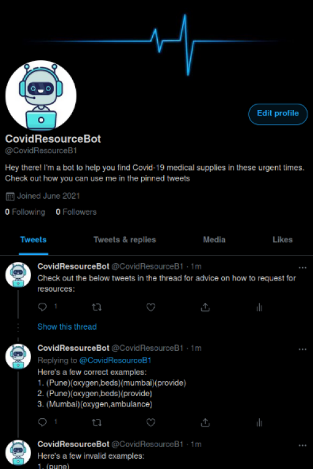
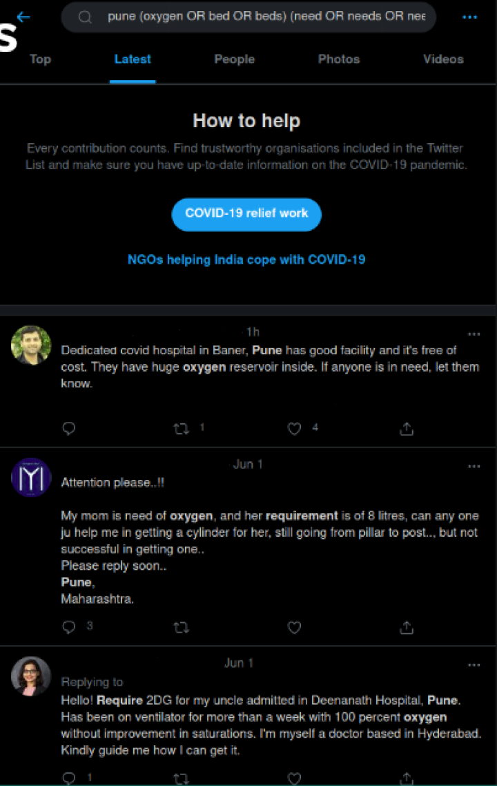

<!-- PROJECT LOGO -->
 

  

  <h3 align="center">Covid Resource Bot</h3>

<!-- ABOUT THE PROJECT -->
## About The Project

The idea behind this project is to develop a Twitter Bot to retrieve necessary information regarding Covid-19 resources quickly and easily. 
Our Twitter bot aims to make searching for Covid resources easier, users can enter different parameters in their tweets while tagging the bot.

Removed twitter handles to respect privacy of the users 

#### Additional features:

- Corrects any potential spelling errors
- Quick replies with links to resources

### Built With

* [Twitter API](https://developer.twitter.com/en)
* [Python](https://www.python.org/)
* [SQLite](https://www.sqlite.org/index.html)

<!-- CONTRIBUTING -->
## Contributing

We are looking for ways to improve this project through optimizations or new features. Here's how you can contribute to FitWave:

1. Fork the Project
2. Create your Feature Branch (`git checkout -b feature/AmazingFeature`)
3. Commit your Changes (`git commit -m 'Add some AmazingFeature'`)
4. Push to the Branch (`git push origin feature/AmazingFeature`)
5. Open a Pull Request
